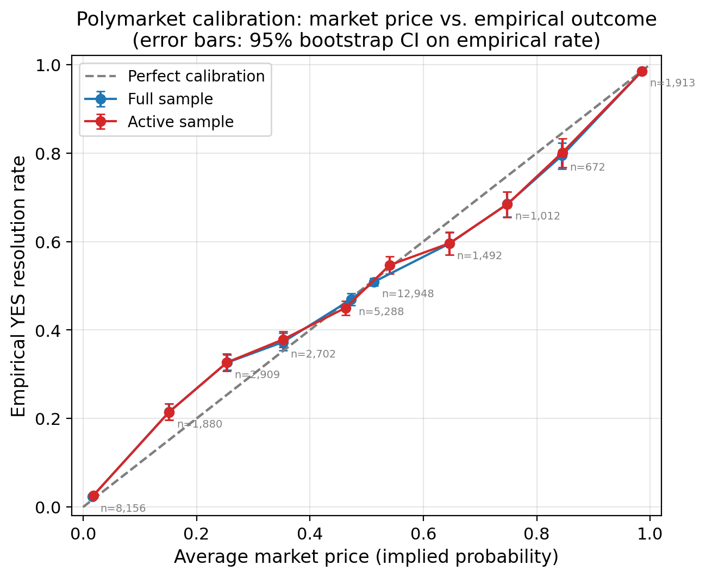
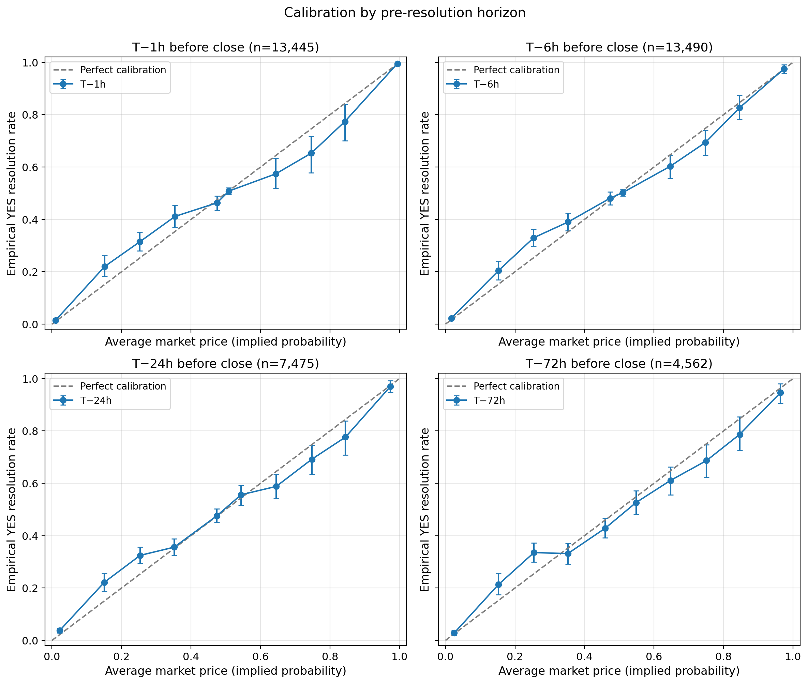
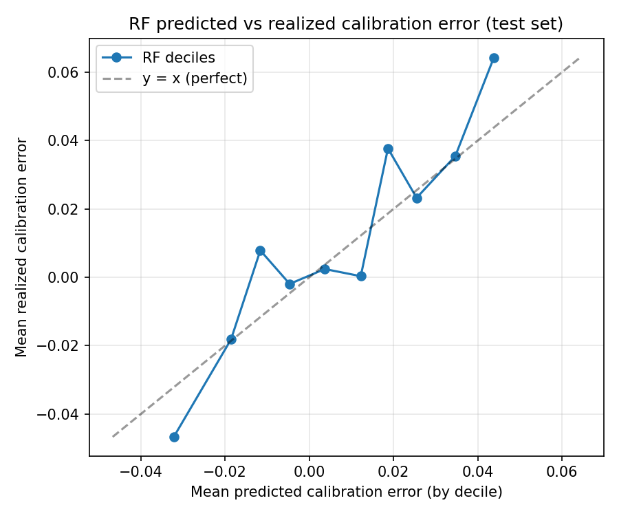
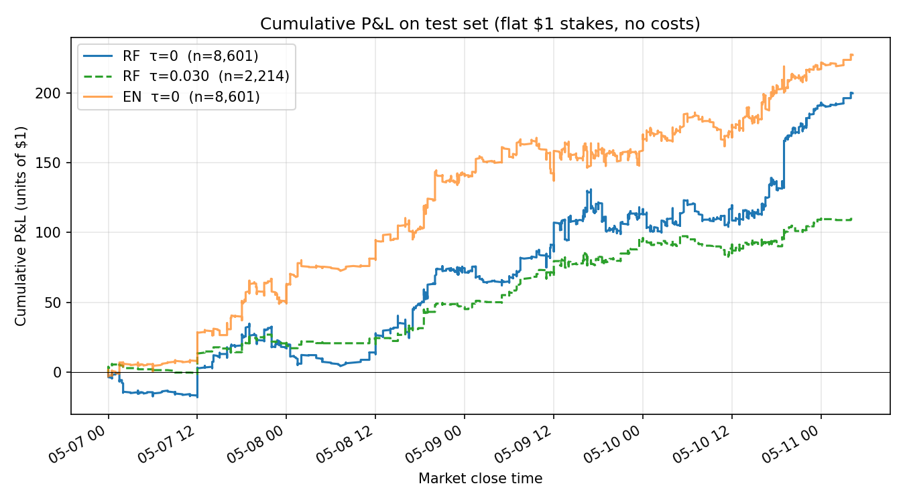
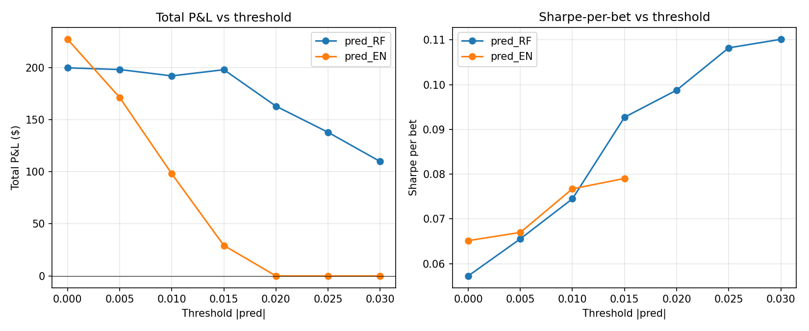

# Alpha Generation in Prediction Markets

Quantitative analysis of Polymarket event contracts using probability calibration, machine-learning models, and out-of-sample strategy backtesting.

This project was developed as my master's thesis in Applied Mathematics at Columbia University. It studies whether systematic pricing errors in binary prediction-market contracts can be identified and translated into a simple trading signal.

## Research Questions

1. Are prediction-market prices well calibrated as implied probabilities?
2. Do pricing errors exhibit systematic cross-sectional patterns?
3. Can market features predict those errors out-of-sample?
4. Can predicted pricing errors be translated into a threshold-based trading strategy?

## Key Findings

- **Reverse favorite–longshot bias:** 6 of 10 price bins were statistically miscalibrated at the 95% bootstrap confidence level. In the `(0.2, 0.3]` bin, moderate longshots were underpriced by approximately 7.3 percentage points.
- **Small out-of-sample predictive improvement:** Random Forest forecasts reduced the Brier score from 0.1650 for the raw market-price baseline to 0.1641. Directional predictability was clearest in the extreme predicted-residual deciles.
- **Conviction filtering improved per-bet signal quality:** Sharpe-per-bet increased from 0.057 with no prediction threshold to 0.110 at `τ = 0.030`, while out-of-sample P&L remained positive.
- **Results are preliminary:** The improvements are modest and the out-of-sample evaluation window is short. This project should be interpreted as a quantitative research methodology study rather than a production-ready strategy.


## Calibration Analysis

Each Polymarket contract resolves to either 1 for YES or 0 for NO. The observed YES-token price can therefore be interpreted as the market-implied probability of resolution.

The calibration analysis compares average quoted prices with empirical YES-resolution rates across probability bins.



The calibration curve exhibits a reverse S-shape: moderate longshots resolved YES more often than their prices implied, while moderate favorites resolved YES less often than their prices implied.

The same broad pattern persists across multiple time-to-resolution horizons.



## Predictive Modeling

The modeling target is the realized pricing residual:

$$
\epsilon_t = R - p_t
$$

where:

- $R \in \{0,1\}$ is the final contract resolution;
- $p_t$ is the YES-token price observed at snapshot time $t$;
- $\epsilon_t$ is the realized pricing error.

The models estimate the conditional expected residual using only information available at the time of each snapshot:

$$
\hat{\epsilon}_t \approx \mathbb{E}[\epsilon_t \mid X_t]
$$

### Features

The feature set includes:

- current price level;
- short-horizon price momentum;
- recent price volatility;
- log trading volume;
- market category;
- time remaining until resolution.

### Evaluation Design

To avoid look-ahead bias, the analysis uses:

- a chronological 70/30 train-test split;
- time-series cross-validation within the training period;
- evaluation on held-out observations only.

### Model Comparison

| Model | Out-of-Sample Brier Score |
|---|---:|
| Naive 50% forecast | 0.2500 |
| Market-price baseline | 0.1650 |
| Elastic Net | 0.1647 |
| Random Forest | 0.1641 |

Lower Brier scores indicate more accurate probability forecasts.

The Random Forest model shows the clearest directional signal in the most extreme predicted-residual deciles.



## Backtest

The strategy uses the sign and magnitude of the predicted residual:

- buy YES when the model predicts that the contract is underpriced;
- buy NO when the model predicts that the contract is overpriced;
- remain flat when the absolute predicted residual does not exceed a selected threshold.

The backtest uses flat \$1 stakes and evaluates performance across a sweep of conviction thresholds.





Conviction filtering reduced the number of trades but improved average risk-adjusted performance per bet. Sharpe-per-bet increased from 0.057 with no threshold to 0.110 at `τ = 0.030`. Total P&L remained positive across the evaluated thresholds, although it decreased as the strategy became more selective.

These values are not annualized portfolio Sharpe ratios. They measure mean payoff divided by the standard deviation of payoff across individual bets and are intended as a simple comparison of signal quality across thresholds.

## Data Pipeline

The project uses two public Polymarket data sources:

- the **Gamma API** for resolved-market metadata;
- the **CLOB API** for historical YES-token price data.

The full pipeline:

```text
resolved-market metadata
        ↓
historical price collection
        ↓
cohort filtering and price manifest
        ↓
snapshot panel construction
        ↓
feature engineering
        ↓
chronological model training
        ↓
out-of-sample residual forecasts
        ↓
threshold-based backtest
```

## Repository Structure

```text
prediction-markets-thesis/
├── README.md
├── requirements.txt
├── src/
│   ├── collect_markets.py
│   ├── collect_prices.py
│   ├── build_price_manifest.py
│   ├── build_snapshots.py
│   ├── train_models.py
│   └── backtest.py
└── results/
    └── figures/
```

Raw data, processed datasets, serialized model files, and local diagnostic utilities are intentionally excluded from the public repository.

## Setup

```bash
python -m venv .venv
source .venv/bin/activate
pip install -r requirements.txt
```

## Reproducing the Pipeline

### 1. Collect resolved-market metadata

```bash
python src/collect_markets.py --max-markets 2000
```

### 2. Collect historical price data

```bash
python src/collect_prices.py
```

### 3. Build the eligible-market cohort

```bash
# Filter the cached price files into a cohort — runs on already-collected data,
# no additional API calls. Adjust thresholds here without re-running collection.
python src/build_price_manifest.py --min-volume 10000 --max-age-days 25
```

### 4. Construct the modeling panel

```bash
python src/build_snapshots.py
```

### 5. Train the models

```bash
python src/train_models.py
```

### 6. Run the backtest

```bash
python src/backtest.py
```

The API data is not stored in the repository because it is large and re-fetchable. Historical availability may vary because the CLOB API retains price histories for a limited period after market resolution.

## Limitations

- The out-of-sample test window covers five days, from May 7–11, 2026. Results should be interpreted as a methodology pilot rather than evidence of a stable production signal.
- The conviction threshold `τ = 0.030` was selected post hoc based on test-set Sharpe-per-bet. Threshold-level results should therefore be interpreted as exploratory rather than as independently validated strategy performance.
- Historical CLOB price retention restricted the analysis to recently resolved contracts.
- The backtest uses flat $1 stakes and does not model# Alpha Generation in Prediction Markets

Quantitative analysis of Polymarket event contracts using probability calibration, machine-learning models, and out-of-sample strategy backtesting.

This project was developed as my master's thesis in Applied Mathematics at Columbia University. It studies whether systematic pricing errors in binary prediction-market contracts can be identified and translated into a simple trading signal.

## Research Questions

1. Are prediction-market prices well calibrated as implied probabilities?
2. Do pricing errors exhibit systematic cross-sectional patterns?
3. Can market features predict those errors out-of-sample?
4. Can predicted pricing errors be translated into a threshold-based trading strategy?

## Key Findings

- **Reverse favorite–longshot bias:** 6 of 10 price bins were statistically miscalibrated at the 95% bootstrap confidence level. In the `(0.2, 0.3]` bin, moderate longshots were underpriced by approximately 7.3 percentage points.
- **Small out-of-sample predictive improvement:** Random Forest forecasts reduced the Brier score from 0.1650 for the raw market-price baseline to 0.1641. Directional predictability was clearest in the extreme predicted-residual deciles.
- **Conviction filtering improved per-bet signal quality:** Sharpe-per-bet increased from 0.057 with no prediction threshold to 0.110 at `τ = 0.030`, while out-of-sample P&L remained positive.
- **Results are preliminary:** The improvements are modest and the out-of-sample evaluation window is short. This project should be interpreted as a quantitative research methodology study rather than a production-ready strategy.


## Calibration Analysis

Each Polymarket contract resolves to either 1 for YES or 0 for NO. The observed YES-token price can therefore be interpreted as the market-implied probability of resolution.

The calibration analysis compares average quoted prices with empirical YES-resolution rates across probability bins.


The calibration curve exhibits a reverse S-shape: moderate longshots resolved YES more often than their prices implied, while moderate favorites resolved YES less often than their prices implied.

The same broad pattern persists across multiple time-to-resolution horizons.


## Predictive Modeling

The modeling target is the realized pricing residual:

$$
\epsilon_t = R - p_t
$$

where:

- $R \in \{0,1\}$ is the final contract resolution;
- $p_t$ is the YES-token price observed at snapshot time \(t\);
- $\epsilon_t$ is the realized pricing error.

The models estimate the conditional expected residual using only information available at the time of each snapshot:

$$
\hat{\epsilon}_t \approx \mathbb{E}[\epsilon_t \mid X_t]
$$

### Features

The feature set includes:

- current price level;
- short-horizon price momentum;
- recent price volatility;
- log trading volume;
- market category;
- time remaining until resolution.

### Evaluation Design

To avoid look-ahead bias, the analysis uses:

- a chronological 70/30 train-test split;
- time-series cross-validation within the training period;
- next-period evaluation on held-out observations only.

### Model Comparison

| Model | Out-of-Sample Brier Score |
|---|---:|
| Naive 50% forecast | 0.2500 |
| Market-price baseline | 0.1650 |
| Elastic Net | 0.1647 |
| Random Forest | 0.1641 |

Lower Brier scores indicate more accurate probability forecasts.

The Random Forest model shows the clearest directional signal in the most extreme predicted-residual deciles.


## Backtest

The strategy uses the sign and magnitude of the predicted residual:

- buy YES when the model predicts that the contract is underpriced;
- buy NO when the model predicts that the contract is overpriced;
- remain flat when the absolute predicted residual does not exceed a selected threshold.

The backtest uses flat $1 stakes and evaluates performance across a sweep of conviction thresholds.


Conviction filtering reduced the number of trades but improved average risk-adjusted performance per bet. Sharpe-per-bet increased from 0.057 with no threshold to 0.110 at `τ = 0.030`. Total P&L remained positive across the evaluated thresholds, although it decreased as the strategy became more selective.

These values are not annualized portfolio Sharpe ratios. They measure mean payoff divided by the standard deviation of payoff across individual bets and are intended as a simple comparison of signal quality across thresholds.

## Data Pipeline

The project uses two public Polymarket data sources:

- the **Gamma API** for resolved-market metadata;
- the **CLOB API** for historical YES-token price data.

The full pipeline:

```text
resolved-market metadata
        ↓
historical price collection
        ↓
cohort filtering and price manifest
        ↓
snapshot panel construction
        ↓
feature engineering
        ↓
chronological model training
        ↓
out-of-sample residual forecasts
        ↓
threshold-based backtest
```

## Repository Structure

```text
prediction-markets-thesis/
├── README.md
├── requirements.txt
├── src/
│   ├── collect_markets.py
│   ├── collect_prices.py
│   ├── build_price_manifest.py
│   ├── build_snapshots.py
│   ├── train_models.py
│   └── backtest.py
└── results/
    └── figures/
```

Raw data, processed datasets, serialized model files, and local diagnostic utilities are intentionally excluded from the public repository.

## Setup

```bash
python -m venv .venv
source .venv/bin/activate
pip install -r requirements.txt
```

## Reproducing the Pipeline

### 1. Collect resolved-market metadata

```bash
python src/collect_markets.py --max-markets 2000
```

### 2. Collect historical price data

```bash
python src/collect_prices.py
```

### 3. Build the eligible-market cohort

```bash
# Filter the cached price files into a cohort — runs on already-collected data,
# no additional API calls. Adjust thresholds here without re-running collection.
python src/build_price_manifest.py --min-volume 10000 --max-age-days 25
```

### 4. Construct the modeling panel

```bash
python src/build_snapshots.py
```

### 5. Train the models

```bash
python src/train_models.py
```

### 6. Run the backtest

```bash
python src/backtest.py
```

The API data is not stored in the repository because it is large and re-fetchable. Historical availability may vary because the CLOB API retains price histories for a limited period after market resolution.

## Limitations

- The out-of-sample test window covers five days, from May 7–11, 2026. Results should be interpreted as a methodology pilot rather than evidence of a stable production signal.
- The conviction threshold `τ = 0.030` was selected post hoc based on test-set Sharpe-per-bet. Threshold-level results should therefore be interpreted as exploratory rather than as independently validated strategy performance.
- Historical CLOB price retention restricted the analysis to recently resolved contracts.
- The backtest uses flat \$1 stakes and does not model liquidity constraints, market impact, or execution slippage directly.
- Transaction costs are evaluated through simplified sensitivity analysis rather than order-level execution modeling.
- Market-category labels are heuristic.
- The analysis uses a single chronological train-test split. A longer historical window would allow more robust walk-forward evaluation across multiple market regimes.
